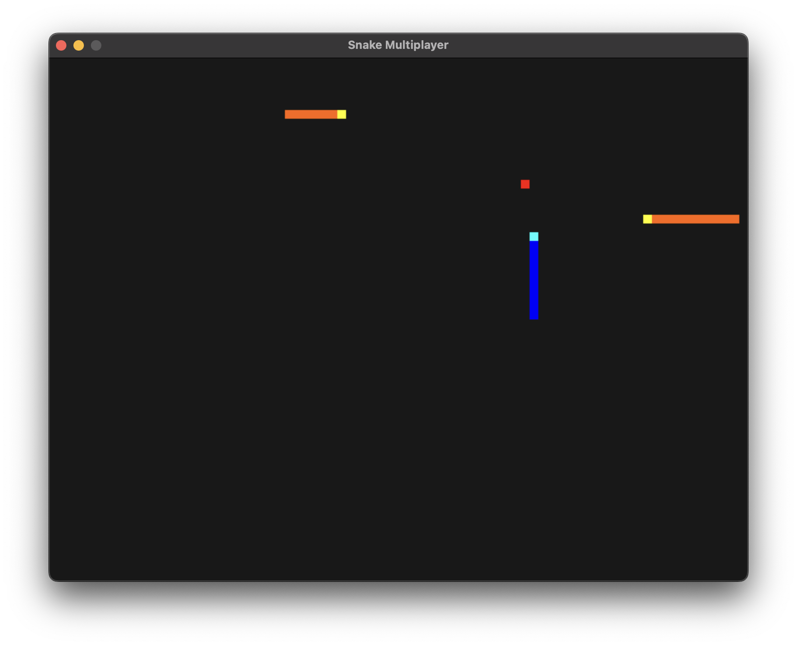

# Snake Multiplayer

A multiplayer snake game in rust, using TCP sockets for communication, and SDL2 for rendering the game.



## Running (development mode)

### Client
```console
cargo run --bin client -- serverip:port
```

### Server (optional)

```console
cargo run --bin server
```